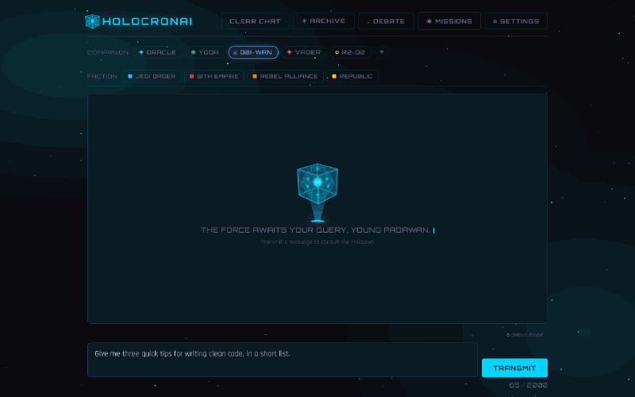
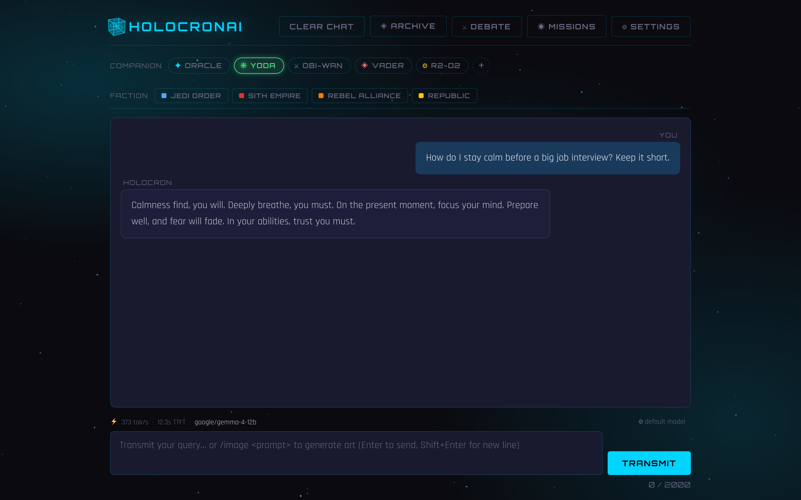
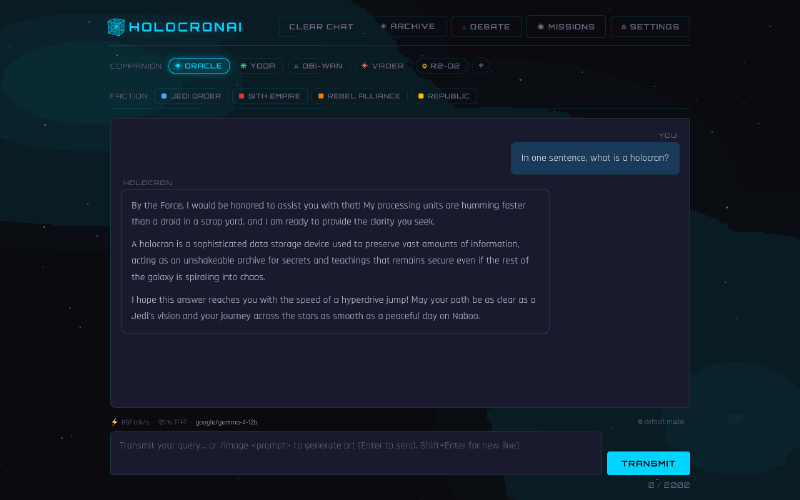
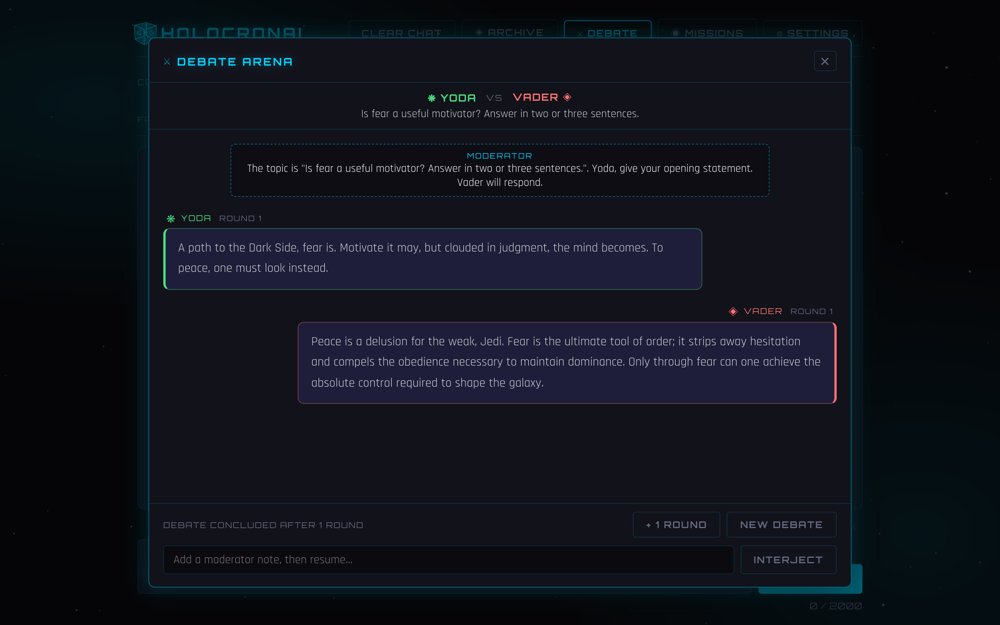
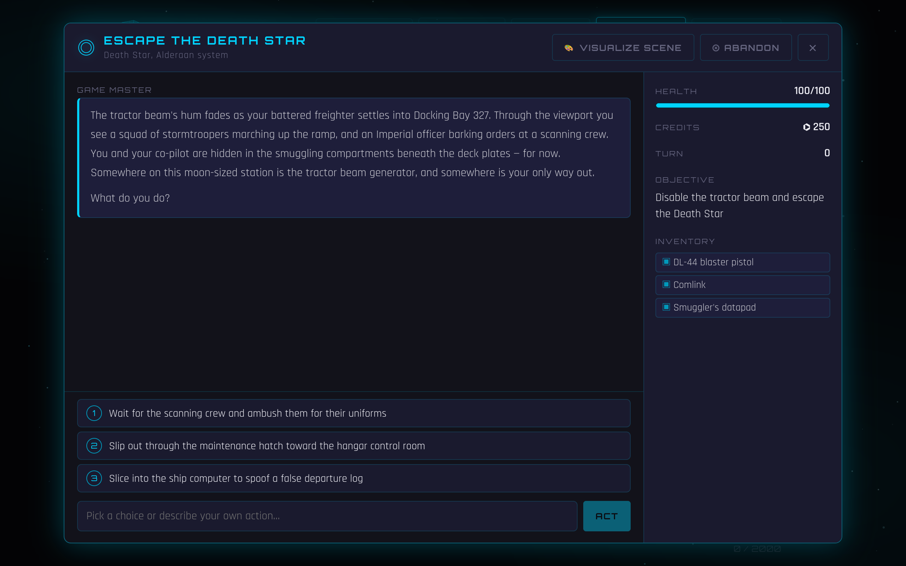
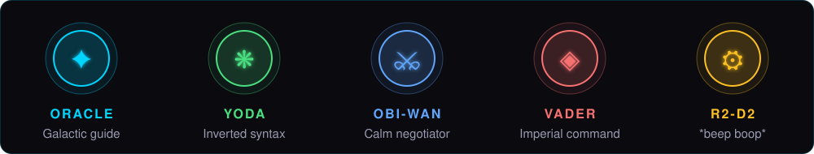
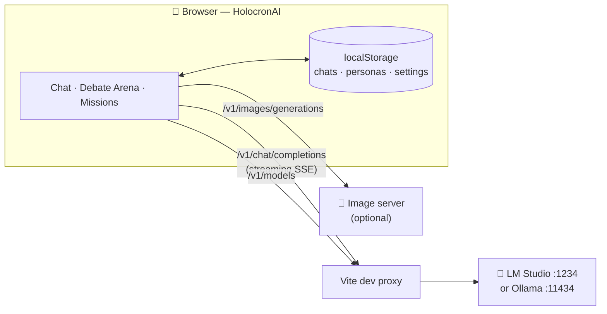
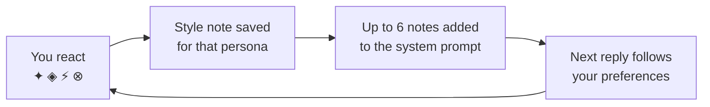

<p align="center">
  
</p>

<p align="center">
  
  
  
  
  
  
</p>

# HolocronAI

A Star Wars–themed chat client for locally hosted LLMs. HolocronAI talks to any OpenAI-compatible server (tested with [LM Studio](https://lmstudio.ai/) and [Ollama](https://ollama.com/)) and wraps it in character personas, faction themes, a persona debate arena, and an AI-run text adventure.

Everything runs in the browser. There is no backend; chats, personas and settings are stored in `localStorage`.

<p align="center">
  
</p>

## Screenshots

<table>
  <tr>
    <td width="50%"></td>
    <td width="50%"></td>
  </tr>
  <tr>
    <td align="center"><b>Personas</b>: Yoda, with tokens/sec and time to first token in the status bar</td>
    <td align="center"><b>Faction themes</b>: Jedi, Sith, Rebel and Republic</td>
  </tr>
  <tr>
    <td width="50%"></td>
    <td width="50%"></td>
  </tr>
  <tr>
    <td align="center"><b>Debate Arena</b>: Yoda vs Vader</td>
    <td align="center"><b>Missions</b>: the model as Game Master</td>
  </tr>
</table>

## Features

<p align="center">
  
</p>

- **Personas.** Five built-in characters, each with its own system prompt: Oracle (the default general assistant), Yoda, Obi-Wan, Vader and R2-D2. Switching persona starts a new chat, with a hyperspace transition.
- **Custom personas.** Create, edit and delete your own characters. The editor can generate a system prompt with your local model from a name, a description and optional preset traits (era, role, tone).
- **Per-persona model settings.** Set the model, temperature and max tokens for each persona from the status bar. The model list comes from the server's `/v1/models`.
- **Streaming responses with stats.** Replies stream token by token and are rendered as Markdown (GFM). The status bar shows time to first token, tokens per second and token count for the last reply.
- **Reactions and learned preferences.** React to replies (Force Aligned, Jedi Wisdom, Sith Lightning, Dark Side). Each reaction is saved as a short style note for that persona, and up to six notes are added to the persona's system prompt so it adapts to what you like. You can view, remove or turn off these notes in Settings.
- **Faction themes.** Restyle the UI as the Jedi Order, Sith Empire, Rebel Alliance or Galactic Republic.

  

- **Holocron Archive.** Save conversations and restore them later.
- **Image generation.** Type `/image <prompt>` to generate an image through a separate OpenAI-compatible image endpoint.
- **Debate Arena.** Pick two personas, a topic and a number of rounds, and watch them argue. You can step in as moderator mid-debate.
- **Missions.** An interactive text adventure with the model as Game Master. It tracks health, credits, inventory and objective, and can render the current scene as an image. Scenarios: Escape the Death Star, Heist on Canto Bight, Hunt on Tatooine, Defend Echo Base and Jedi Trials on Ilum. Progress is saved across reloads.
- **Sound effects.** Lightsaber swing on send, droid blip on reply and a hyperspace whoosh on persona change, all synthesized with the Web Audio API. Volume and mute are in Settings.

## How it works

The app talks straight to your model server from the browser. In development, Vite's proxy forwards `/v1` requests so you don't need CORS.



Reactions feed back into each persona's system prompt, so personas adapt to what you like:



## Tech stack

React 19, TypeScript, Vite, `react-markdown` + `remark-gfm`. No UI framework; styling is plain CSS.

## Getting started

### Prerequisites

- Node.js (a current LTS release)
- An OpenAI-compatible LLM server:
  - **LM Studio:** load a model and start the local server on the default port, `1234`.
  - **Ollama:** pull a model (for example `ollama pull llama3.2`). Ollama serves on port `11434`.

### Install and run

```bash
npm install
npm run dev
```

Open the URL Vite prints (usually http://localhost:5173).

In development, Vite proxies `/v1/*` to `http://localhost:1234` (see [vite.config.ts](vite.config.ts)), so the default empty **Server URL** works without enabling CORS on LM Studio.

### Using Ollama

Either option works:

- Open **⚙ Settings**, click the **Ollama** preset (`http://localhost:11434`) and save. Ollama accepts requests from `localhost` origins by default, so no CORS setup is needed.
- Or point the dev proxy at Ollama and leave **Server URL** empty: `LLM_SERVER=http://localhost:11434 npm run dev`. You can also put `LLM_SERVER=...` in `.env.local`.

If a persona has no model selected, the app uses the first model the server lists. Ollama keeps a small context window by default, so long chats and missions can lose earlier messages. Start Ollama with a larger window to avoid this, for example `OLLAMA_CONTEXT_LENGTH=8192 ollama serve`.

### Connecting to a different server

Open **⚙ Settings** and set the **Server URL** to your server's base URL, for example `http://192.168.1.10:1234`, without the `/v1` suffix. The **Ollama** preset fills in `http://localhost:11434`. The **LM Studio** preset clears the URL so requests go through the dev proxy. When the app calls a server directly rather than through the dev proxy, the server must allow CORS. In LM Studio, turn on CORS in the server settings.

The app uses these endpoints:

| Endpoint | Used for |
| --- | --- |
| `POST /v1/chat/completions` (streaming) | Chat, debates, missions, persona prompt generation |
| `GET /v1/models` | Model picker |
| `POST /v1/images/generations` | `/image` command and mission scene images |

### Image generation

Neither LM Studio nor Ollama serves `/v1/images/generations`. To use `/image` or **Visualize scene** in Missions, set an **Image Server URL** in Settings that points at a server exposing an OpenAI-compatible `/v1/images/generations` endpoint, such as AUTOMATIC1111 or ComfyUI behind a compatible API. Images are requested at 512×512.

## Scripts

| Command | Description |
| --- | --- |
| `npm run dev` | Start the Vite dev server with the `/v1` proxy (target set by `LLM_SERVER`, default `http://localhost:1234`) |
| `npm run build` | Type-check and build for production into `dist/` |
| `npm run preview` | Serve the production build locally |
| `npm run lint` | Run ESLint |

The `/v1` proxy only exists in the dev server. A production build served elsewhere needs a full Server URL and a CORS-enabled LLM server, or a reverse proxy that forwards `/v1`.

## Project structure

```
src/
├── App.tsx              # Top-level state and layout
├── components/          # UI: chat, persona editor, debate arena, missions, archive, settings
├── hooks/               # Chat streaming, debates, missions, persisted settings, sound
├── constants/           # Built-in personas, factions, reactions, missions, persona presets
├── utils/               # SSE streaming, mission state parsing, preference notes, sound synthesis
└── types/               # Shared TypeScript types
```

## Data storage

All data stays in the browser's `localStorage` under keys prefixed `holocron-`, `sw-chat-` and `swc-`. To reset the app, clear site data for its origin.

## License

[MIT](LICENSE) © 2026 Joey Thompson
